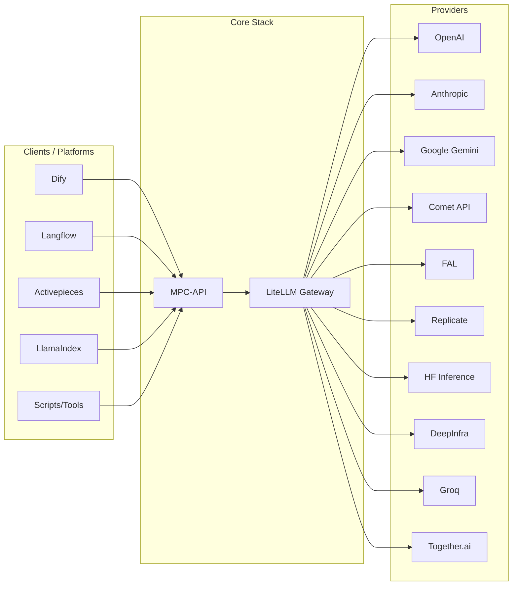
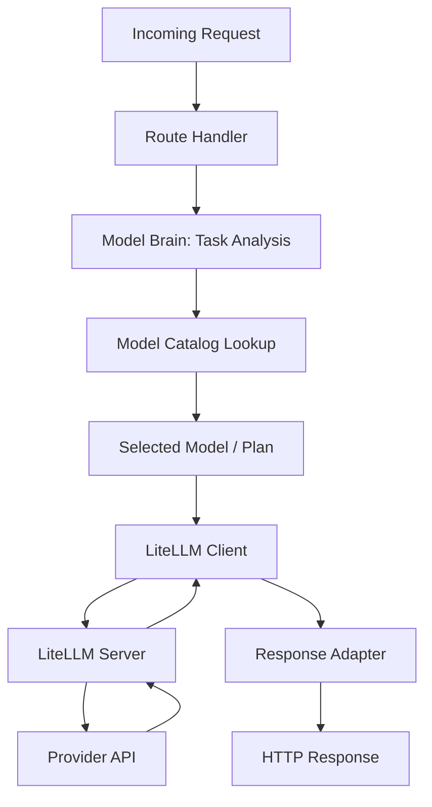
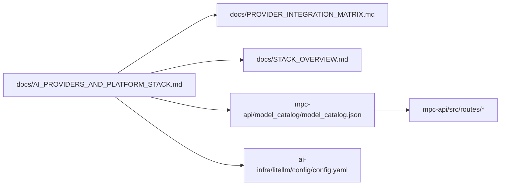

# MPC-API Architecture Diagrams

These diagrams visualise the MPC-API + LiteLLM + provider stack and the relation to external platforms.

---

## 1. High-Level System

## 2. Internal MPC-API Flow

## 3. Files & Ownership

Use these as reference when editing architecture or explaining the stack to new team members.
